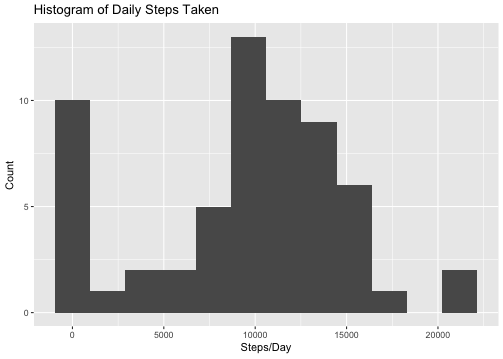
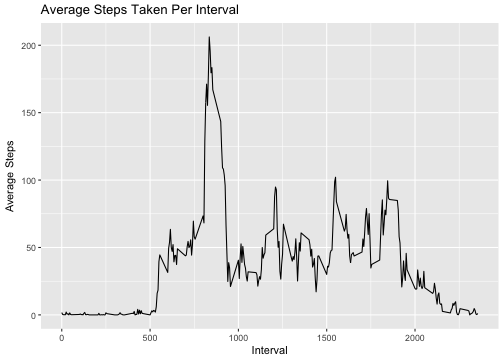

# Reproducible Research: Peer Assessment 1


## Loading and preprocessing the data
Throughout the project, functions will be used from the "tidyverse" collection of packages for data science <a href= http://tidyverse.tidyverse.org>http://tidyverse.tidyverse.org</a>. 


```r
library(tidyverse)
```

Loading the data with correct data types:

```r
actdata <- read_csv("activity.zip", 
                    col_types = cols(
                        steps = col_integer(),
                        date = col_date(format = ""),
                        interval = col_integer()
                        )) 
```
## What is mean total number of steps taken per day?
The activity data is grouped by day and sums calculated

```r
dailysteps <- summarise(group_by(actdata, date), 
                        steps = sum(steps, na.rm = TRUE))

g <- ggplot(dailysteps, aes(steps)) +
    xlab("Steps/Day") + 
    ylab("Count") +
    ggtitle("Histogram of Daily Steps Taken") + 
    geom_histogram(bins=12)
ggsave("figure/stephist.png", dpi=72)

meanstep <- mean(dailysteps$steps)
medianstep <- median(dailysteps$steps)
```

<b>Mean Daily Steps: </b> 9354.23 <br> 
<b>Median Daily Steps: </b> 10395
                    
                 

## What is the average daily activity pattern?
The activity data is grouped by interval and means for each interval calculated.


```r
intervalsteps = summarise(group_by(actdata, interval), 
                          mean = mean(steps, na.rm = TRUE))

g <- ggplot(intervalsteps, aes(interval, mean)) +
    xlab("Interval") + 
    ylab("Average Steps") +
    ggtitle("Average Steps Taken Per Interval") + 
    geom_line()
ggsave("figure/intervalavg.png", dpi=72)

maxintmean <- max(intervalsteps$mean)
maxinterval <- filter(intervalsteps, mean == maxintmean)$interval
```

<b>Interval with Maximum Average Steps: </b>835
(Value: 206.1698113)

  

## Imputing missing values
First, let's count the number of missing measurements:

```r
nacount <- sum(is.na(actdata$steps))
```
<b>Intervals Without Steps: </b>2304

We will impute missing values by taking the floor of the mean steps taken for the interval of the missing value over all days observed.

```r
imputesteps <- function (int) {
    as.integer(filter(intervalsteps, interval==int)$mean) 
}

actdatanew <- rowwise(actdata) %>% 
    mutate(newsteps = ifelse(is.na(steps), 
                             imputesteps(interval), 
                             steps)) %>% ungroup()
```
Now we'll generate new statistics to examine the effects of imputing values. As you can see, by imputing values we are eliminating zero values from the data set which increases the mean and median values.  The histogram is also no longer left-skewed.


```r
newdailysteps <- summarise(group_by(actdatanew, date), 
                        steps = sum(newsteps))

g <- ggplot(newdailysteps, aes(steps)) +
    xlab("Steps/Day") + 
    ylab("Count") +
    ggtitle("Histogram of Daily Steps Taken") + 
    geom_histogram(bins=12)
ggsave("figure/newstephist.png", dpi=72)

newmeanstep <- mean(newdailysteps$steps)
newmedianstep <- median(newdailysteps$steps)
```

<b>New Mean Daily Steps: </b> 10749.77 <br> 
<b>New Median Daily Steps: </b> 10641

 

## Are there differences in activity patterns between weekdays and weekends?
Add a column to the data set to indicate whether the date is a weekday or a weekend. Then calculate the average steps taken for each interval on weekdays and weekends.  

```r
actdatanew <- rowwise(actdatanew) %>% 
    mutate(wday = factor(ifelse(weekdays(date) %in% c("Saturday", "Sunday"), 
                                "weekend", 
                                "weekday"),
                         levels = c("weekday", "weekend"))) %>% ungroup()

wdaymean <- summarise(group_by(actdatanew, interval, wday), 
                        meansteps = mean(newsteps))
g <- ggplot(wdaymean, aes(interval, meansteps)) +
    xlab("Interval") + 
    ylab("Average Steps") +
    ggtitle("Average Steps Taken Per Interval") + 
    facet_wrap(~wday, ncol=1) +
    geom_line()
ggsave("figure/wday.png", dpi=72)
```

<BR>

Comparing weekday and weekend activity yields the following:
<UL>
 <LI>Highest activity levels on weekends and weekdays are between 8AM and 9:30AM 
 <LI>Activity levels between 8AM and 9:30AM are higher on weekdays
 <LI>Activity levels are higher after 8PM on weekends
</UL>
